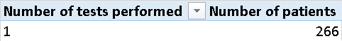

# MAMMOGRAPHY-DELTA
Machine learning project for mammography diagnosis

## Resources Used For The Project: 
https://drive.google.com/file/d/1dvlRWzQ_WvoSpdhsnlJPw-1iqYQPS0x6/view

## First Time Setup

Use Python 3.9.

To set up project, run following commands:

`python3.9 -m venv venv`

`source venv/bin/activate`  

`pip install --upgrade pip setuptools wheel`

`pip install numpy==1.26.4`

`pip install pyradiomics==3.0.1 --no-build-isolation`

`pip install -r requirements.txt`

## Data Analysis

No missing values in CSV. 

All rows do not contain empty values.

Total records in CSV: **1664**

### Class Distribution

| Class         | Count | Distribution          | Percentage |
|:--------------|:-----:|:----------------------|:----------:|
| **BENIGN**    |  901  | `██████████░░░░░░░░░` |   54.15%   |
| **MALIGNANT** |  763  | `████████░░░░░░░░░░░` |   45.85%   |

### Assessment Distribution

| BI-RADS Score | Count | Distribution           | Percentage |
|:-------------:|:-----:|:-----------------------|:----------:|
|     **0**     |  162  | `██░░░░░░░░░░░░░░░░░░` |   9.74%    |
|     **1**     |   3   | `░░░░░░░░░░░░░░░░░░░░` |   0.18%    |
|     **2**     |  89   | `█░░░░░░░░░░░░░░░░░░░` |   5.35%    |
|     **3**     |  358  | `████░░░░░░░░░░░░░░░░` |   21.51%   |
|     **4**     |  689  | `████████░░░░░░░░░░░░` |   41.41%   |
|     **5**     |  363  | `████░░░░░░░░░░░░░░░░` |   21.81%   |

### Number of Patients Examined

Number of actual patients: 888

Number of patients examined once: **266**   

[List of patients (xlsx)](data_analysis/Patients_examined_once.xlsx)

[List of patients (csv)](data_analysis/Patients_examined_once.csv)

Number of patients examined more than once: **622**   

[List of patients (xlsx)](data_analysis/Patients_examined_more_than_once.xlsx)

[List of patients (csv)](data_analysis/Patients_examined_more_than_once.csv)

### Data Analysis Conclusions
No records were rejected. 
Assessment distribution imbalance problem will be solved 
separately, as well as the problem of patients with the same ID in the test 
and training sets (Data Leakage prevention).

We have decided not to reject any record, because
all masks and records in labels.csv file match
and all rows do not contain empty values.

Because of balanced class distribution we have decided
not to implement any class weight function. 

BI-RADS Score assessment distribution in very imbalanced.
When implementing Multiclass Classification model, class weights
function is crucial.

## Mask Preprocessing (TODO)

## Shape Feature Extraction

### Preparation Before Feature Extraction

Before feature extraction, images were converted from OpenCV's 0-255 pixel range into boolean (True/False) NumPy arrays.
Next, holes within the objects were filled using `ndimage.binary_fill_holes` (SciPy). 
After labeling the connected components, the largest region was isolated as the main lesion.

`shape_features` module was implemented to extract all basic image features. Best features were selected
after analysis and testing - see Feature Selection section.
Finally, we decided not to include Euler Number feature because of image resolution imbalance
and Solidity feature implementation. Resize image function was not used to extract 
these features to prevent distortion of the object's edges.

### Extracted Features Description

Description of features from [scikit-image documentation](https://scikit-image.org/docs/0.25.x/api/skimage.measure.html#skimage.measure.regionprops
)

| Feature Name            | Category               | Description (Source Code Comments)                                                                                                                                                                                                                                                                                                                                                                                                                                                                                |
|:------------------------|:-----------------------|:------------------------------------------------------------------------------------------------------------------------------------------------------------------------------------------------------------------------------------------------------------------------------------------------------------------------------------------------------------------------------------------------------------------------------------------------------------------------------------------------------------------|
| **Area**                | Standard (regionprops) | Area of the region i.e. number of pixels of the region scaled by pixel-area.                                                                                                                                                                                                                                                                                                                                                                                                                                      |
| **Area Bounding Box**   | Standard (regionprops) | Area of the bounding box i.e. number of pixels of bounding box scaled by pixel-area.                                                                                                                                                                                                                                                                                                                                                                                                                              |
| **Area Convex**         | Standard (regionprops) | Area of the convex hull image, which is the smallest convex polygon that encloses the region.                                                                                                                                                                                                                                                                                                                                                                                                                     |
| **Area Filled**         | Standard (regionprops) | Area of the region with all the holes filled in.                                                                                                                                                                                                                                                                                                                                                                                                                                                                  |
| **Axis Major Length**   | Standard (regionprops) | The length of the major axis of the ellipse that has the same normalized second central moments as the region.                                                                                                                                                                                                                                                                                                                                                                                                    |
| **Axis Minor Length**   | Standard (regionprops) | The length of the minor axis of the ellipse that has the same normalized second central moments as the region.                                                                                                                                                                                                                                                                                                                                                                                                    |
| **Centroid (X, Y)**     | Standard (regionprops) | Centroid coordinate tuple (row, col).                                                                                                                                                                                                                                                                                                                                                                                                                                                                             |
| **Eccentricity**        | Standard (regionprops) | Eccentricity of the ellipse that has the same second-moments as the region. The eccentricity is the ratio of the distance between focal points over the major axis length. The value is in the interval [0, 1). When it is 0, the ellipse becomes a circle.                                                                                                                                                                                                                                                       |
| **Extent**              | Standard (regionprops) | Ratio of pixels in the region to pixels in the total bounding box. Computed as area / (rows * cols).                                                                                                                                                                                                                                                                                                                                                                                                              |
| **Equivalent Diameter** | Standard (regionprops) | The diameter of a circle with the same area as the region.                                                                                                                                                                                                                                                                                                                                                                                                                                                        |
| **Feret Diameter Max**  | Standard (regionprops) | Maximum Feret’s diameter computed as the longest distance between points around a region’s convex hull contour as determined by find_contours.                                                                                                                                                                                                                                                                                                                                                                    |
| **Perimeter**           | Standard (regionprops) | Perimeter of object which approximates the contour as a line through the centers of border pixels using a 4-connectivity.                                                                                                                                                                                                                                                                                                                                                                                         |
| **Solidity**            | Standard (regionprops) | Ratio of pixels in the region to pixels of the convex hull image.                                                                                                                                                                                                                                                                                                                                                                                                                                                 |
| **Orientation**         | Standard (regionprops) | Angle between the 0th axis (rows) and the major axis of the ellipse that has the same second moments as the region, ranging from -pi/2 to pi/2 counter-clockwise.                                                                                                                                                                                                                                                                                                                                                 |
| **Aspect Ratio**        | Calculated (manual)    | Elongation measure. 1.0 = circle/square. High values (> 1.5) indicate an elongated (ellipsoidal) shape. **Formula:** `Major_Axis / Minor_Axis`                                                                                                                                                                                                                                                                                                                                                      |
| **Circularity**         | Calculated (manual)    | Measures roundness + edge smoothness. 1.0 = perfect circle. Highly sensitive to jagged edges (decreases significantly with edge noise). Circularity is very low in case of mallignant tumor. Mask smoothing function in preprocessing module reduces edge noise to increase Circularity result in case of relatively round object. This may increase the discrimination between malignant and benign lesions by increasing Circularity feature range. **Formula:** `(4 * π * Area) / (Perimeter^2)` |
| **Convexity**           | Calculated (manual)    | Ratio of convex hull perimeter to actual perimeter. Near 1.0 = smooth boundary. Low value = deep indentations or spicules (star-shaped). **Formula:** `Perimeter_Convex / Perimeter`                                                                                                                                                                                                                                                                                                                |
| **Irregularity Index**  | Calculated (manual)    | Deviation from a circle. 1.0 = circle. Higher values indicate a complex, rough border compared to the area. **Formula:** `Perimeter / (2 * sqrt(π * Area))`                                                                                                                                                                                                                                                                                                                                         |
| **Roundness**           | Calculated (manual)    | Measures how well the area fits a circle, ignoring edge roughness. Robust metric: tells if the overall silhouette is round, even if edges are jagged. **Formula:** `(4 * Area) / (π * Major_Axis^2)`                                                                                                                                                                                                                                                                                                |
| **Shape Factor**        | Calculated (manual)    | Inverse measure of compactness. Min ~12.57 (circle). Higher values = less compact / more irregular boundary. **Formula:** `Perimeter^2 / Area`                                                                                                                                                                                                                                                                                                                                                      |
| **Hu Moments (1-7)**    | Moments                | A set of 7 numbers that are invariant to scale, translation, and rotation. If the tumor is rotated 90 degrees or is twice as large, the Hu Moments will remain (almost) the same. Raw Hu Moments can be 10^30 (too large for ML models). We apply a log transform to bring them to a usable range (e.g., -30 to 30). **Transformation:** `-1 * sign(hu) * log10(abs(hu))`                                                                                                                           |

## Feature Selection (TODO)
