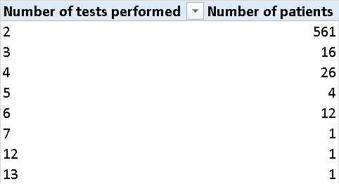

## Data Analysis

### Records Analysis & NULL Values

No missing values in CSV. All rows do not contain empty values. Total records in CSV: **1664**

### Class Distribution

| Class         | Count | Distribution          | Percentage |
|:--------------|:-----:|:----------------------|:----------:|
| **BENIGN**    |  901  | `██████████░░░░░░░░░` |   54.15%   |
| **MALIGNANT** |  763  | `████████░░░░░░░░░░░` |   45.85%   |

### Assessment Distribution

| BI-RADS Score | Count | Distribution           | Percentage |
|:-------------:|:-----:|:-----------------------|:----------:|
|     **0**     |  162  | `██░░░░░░░░░░░░░░░░░░` |   9.74%    |
|     **1**     |   3   | `░░░░░░░░░░░░░░░░░░░░` |   0.18%    |
|     **2**     |  89   | `█░░░░░░░░░░░░░░░░░░░` |   5.35%    |
|     **3**     |  358  | `████░░░░░░░░░░░░░░░░` |   21.51%   |
|     **4**     |  689  | `████████░░░░░░░░░░░░` |   41.41%   |
|     **5**     |  363  | `████░░░░░░░░░░░░░░░░` |   21.81%   |

### Number of Patients Examined

Number of actual patients: 888

Number of patients examined once: **266**

[List of patients (xlsx)](patient_split/Patients_examined_once.xlsx) | [List of patients (csv)](patient_split/Patients_examined_once.csv)

Number of patients examined more than once: **622**

[List of patients (xlsx)](patient_split/Patients_examined_more_than_once.xlsx) | [List of patients (csv)](patient_split/Patients_examined_more_than_once.csv)

### Data Analysis Conclusions

**General Data Integrity**

* No records were rejected as all masks and records in `labels.csv` match, and the dataset contains no missing values.
* **Data Leakage Prevention:** The issue of patients with the same ID appearing multiple times (verified in the "Number
  of Patients Examined" section) requires a strictly patient-aware split strategy (e.g., `StratifiedGroupKFold`) to
  prevent training and testing on the same patient.

**Class Balance (Target Variable)**

* The target classes are relatively balanced (**Benign: 54.15%**, **Malignant: 45.85%**).
* **Decision:** Due to this natural balance, we have decided **not to implement** any class weight balancing
  techniques (like SMOTE or weighted loss) for the binary classification model.

**BI-RADS Assessment Analysis (Clinical Context)**

* **High Ambiguity (The "Gray Zone"):** The dataset is heavily dominated by **BI-RADS 4** cases (**41.41%**).
* Clinically, BI-RADS 4 represents "suspicious abnormalities" where mammographic findings are insufficient to confirm
  benignity or malignancy, necessitating a biopsy.
* **Implication for Modeling:** The high prevalence of these ambiguous cases suggests that classification based
  on **binary masks (shape features)** will be challenging. In this category, the morphological boundaries between
  benign and malignant lesions are often blurred and overlapping, unlike in BI-RADS 2 (Benign) or BI-RADS 5 (Highly
  Suggestive of Malignancy).

* **Distribution Imbalance:** The BI-RADS score distribution is highly skewed. Scores 0, 1, and 2 represent a
  minority (~15%), while scores 3, 4, and 5 constitute the vast majority (~85%).
* **Decision:** If a Multiclass Classification model predicting BI-RADS scores is implemented in the future, applying **class weights** will be crucial to handle the underrepresented lower scores.

---
