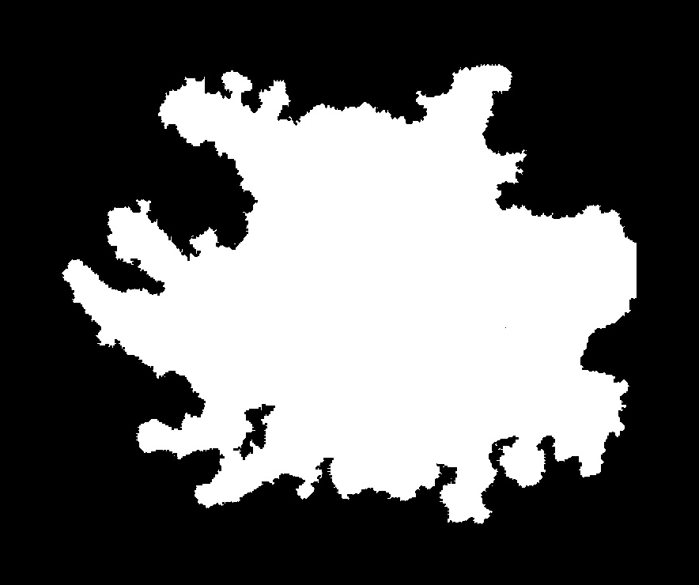
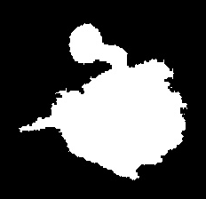
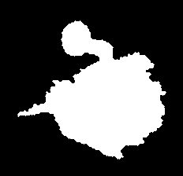
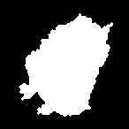
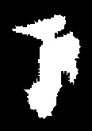
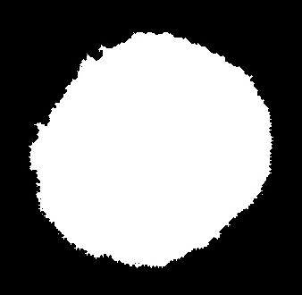
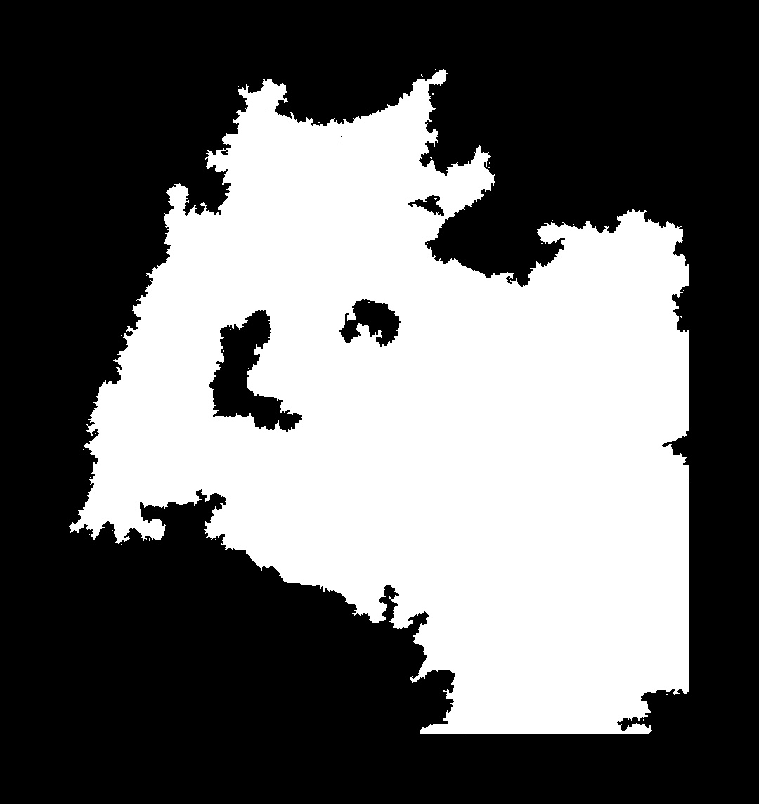
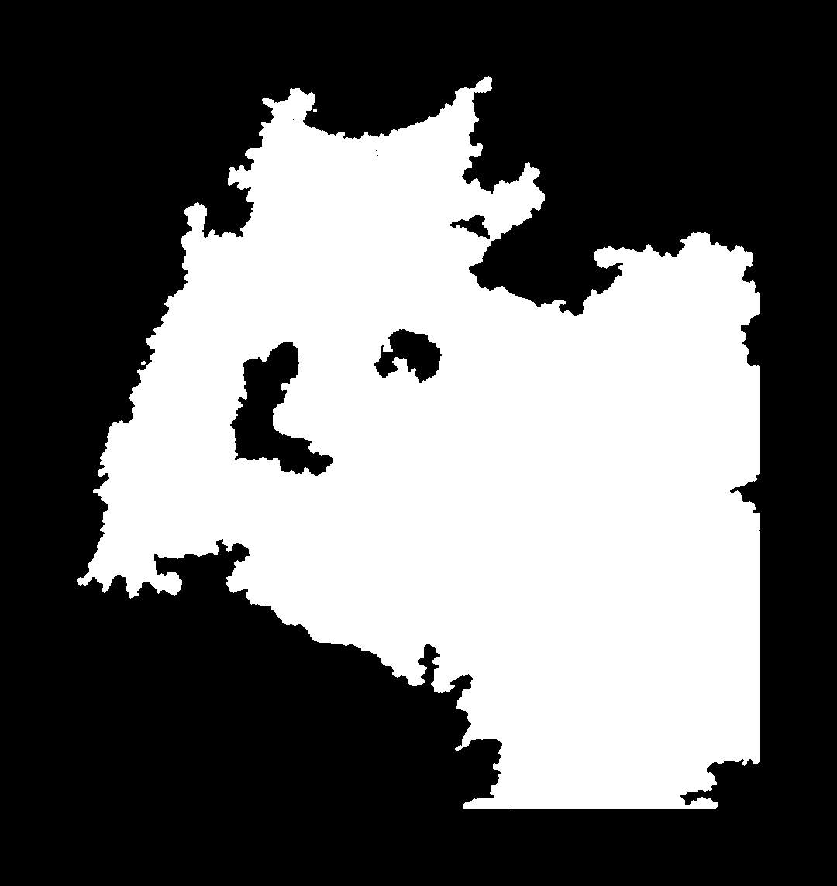

## Mask Preprocessing Module

This module provides a robust pipeline for cleaning, binarizing, and filtering medical image masks. It includes
algorithms to handle noise reduction, edge smoothing, and object selection based on connectivity and area.

---

### `clean_mask`

**Description**
The main function that executes the full preprocessing pipeline on a single image. It handles the
entire workflow from loading the raw image to returning a preprocessed binary mask.

**Key Features**

* **Automated Pipeline:** Sequentially executes loading, binarization, smoothing, and filtering.
* **Flexible Filtering:** Can be configured to retain either the single largest object (e.g., the main ROI) or all
  objects exceeding a specific size threshold.
* **Edge Smoothing:** Automatically applies morphological opening to reduce pixel noise around the edges.

**Parameters**

* `path` (str): File path to the source image.
* `min_area` (int): Minimum pixel area required to keep a component (used if `only_largest=False`).
* `only_largest` (bool): If set to `True`, the function discards everything except the single largest connected
  component.

**Returns**

* `np.array`: The final processed binary mask.

---

### `smooth_mask_edges`

**Description**
Refines the boundaries of a binary mask using morphological operations. This function is critical for improving the
accuracy of shape descriptors by removing pixel noise.

**Key Features**

* **Dynamic Kernel Size:** Calculates the smoothing kernel size relative to the image dimensions (`0.5%` of the smallest
  dimension). This ensures consistent smoothing regardless of image resolution.
* **Biological Shape Optimization:** Uses an **elliptical kernel** (`cv2.MORPH_ELLIPSE`) instead of a square one, which
  is better suited for smoothing organic, round biological structures.
* **Morphological Opening:** Performs erosion followed by dilation to remove small protrusions and noise from the
  edges of the mask.

**Parameters**

* `mask` (np.array): The input binary mask.
* `smoothing_factor` (float): Ratio used to determine kernel size (default: 0.005).

**Returns**

* `np.array`: The smoothed binary mask.

---

### `filter_by_area` & `get_largest_connected_component`

**Description**
Functions responsible for cleaning the mask based on object connectivity and size.

* **`get_largest_connected_component`**: Identifies all connected components in the mask and keeps only the one with the
  largest area. Useful for removing background artifacts when a single ROI is expected.
* **`filter_by_area`**: Iterates through all connected components and removes those smaller than `min_area`. Useful for
  removing "dust" or small noise while keeping multiple valid regions.

**Parameters**

* `image/binary_image` (np.array): Input binary mask.
* `min_area` (int): (For `filter_by_area` only) The threshold in pixels.

**Returns**

* `np.array`: A cleaned binary mask.

---

### `mask_binarization`

**Description**
Converts input images into binary masks (0 and 255). It handles color space conversion automatically.

**Key Features**

* **Auto-Grayscale:** Automatically detects if the input is a color image (BGR) and converts it to grayscale before
  thresholding.
* **Configurable Threshold:** Allows adjustment of the threshold value (default: 128) and thresholding type.
* **Binarization:** All pixel values below threshold are converted into 0 (pure black) and 255 (pure white) above
  threshold.

**Parameters**

* `image` (np.array): Input image.
* `grey_scale` (int): Threshold value (0-255).
* `max_val` (int): Value assigned to pixels passing the threshold (usually 255).

**Returns**

* `np.array`: Binary mask.

---

Below are presented seven sample binary masks before and after preprocessing.

| ID     |                                                   Original Mask                                                   |                                                     Preprocessed Mask                                                     |
|:-------|:-----------------------------------------------------------------------------------------------------------------:|:-------------------------------------------------------------------------------------------------------------------------:|
|
| `1105` |  |  |
|
| `1142` |  |  |
|
| `1505` |  |  |
|
| `1529` |  |  |
|
| `1538` |  |  |
|
| `2168` |  |  |
|
| `2332` |  |  |