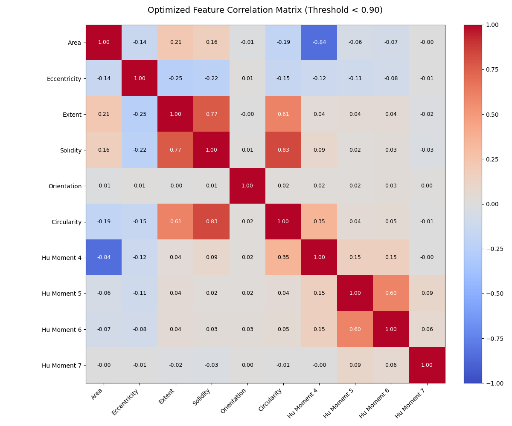

## Feature Selection 
To optimize the model's performance and prevent multicollinearity, an automated feature selection process was implemented based on the Exploratory Data Analysis (EDA) findings.

### Automated Correlation Filter
Using the `src/feature_engineering/selection.py` module, we perform the following:
* **Method**: Spearman Rank Correlation (chosen for its robustness against outliers identified during EDA).
* **Threshold**: Features with an absolute correlation coefficient $|r| > 0.90$ are automatically removed.
* **Redundancy Reduction**: Highly redundant clusters, such as those within lesion size metrics (e.g., `Area` vs. `Area Convex` where $r=0.99$), are reduced to a single representative feature.
* **Benefit**: This simplifies the feature space, reduces the risk of overfitting, and improves the stability of distance-based models like SVM and KNN.

### Optimized Feature Set
The final predictors selected for model training are:
* **Shape & Elongation**: `Eccentricity`, `Extent`, `Orientation`.
* **Boundary Complexity**: `Solidity`, `Circularity`.
* **Geometric Invariants**: `Hu Moment 4`, `Hu Moment  Hu 5`, `Hu Moment 6`, `Hu Moment 7`.

### Visual Verification
The heatmap below demonstrates the correlation matrix of the optimized set. Notice the absence of extreme "hot spots" ($|r| > 0.90$), confirming that the remaining features provide independent geometric information.

---