## Image Resize Function

### `resize_with_padding`

**Description**

Standardizes input images to a fixed square size (default: 224x224 px) while preserving the original aspect ratio. This
function implements a specific strategy to handle different image resolutions without introducing quality loss. It is
advisable to use the function only when CNN is used. Otherwise, some shape-related features might be distorted.

**Key Features**

* **Large Images:** Downscaled using high-quality Lanczos resampling with black padding to maintain the aspect ratio.
* **Small Images:** No scaling is applied. The original image is centered on a black canvas. This strictly avoids
  upscaling artifacts (interpolation), which is critical for preserving texture details in small Regions Of Interests.

**Parameters**

* `img` (np.array | PIL.Image): The input image to be processed.
* `target_size` (int): The target width and height of the output image (default: 224).

**Returns**

* `PIL.Image`: The processed, resized, and padded image.

---

### Sample Masks Before and After Resizing

Below are some examples of using the resize function and its effect on image padding, resolution and ROIs details.

| ID     |                                                     Original Mask                                                     |                                             Resized Mask                                              |
|:-------|:---------------------------------------------------------------------------------------------------------------------:|:-----------------------------------------------------------------------------------------------------:|
| `1003` | <a href="resized_images/1003_before_resizing.png">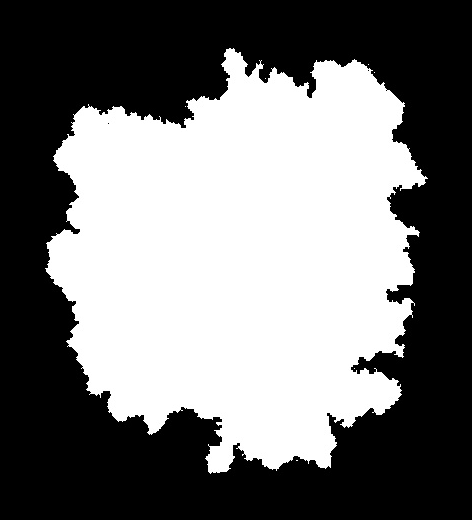</a> | <a href="resized_images/1003_resized.png">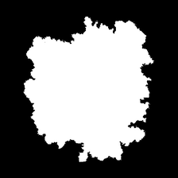</a> |
| `1176` | <a href="resized_images/1176_before_resizing.png">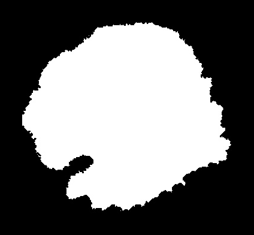</a> | <a href="resized_images/1176_resized.png">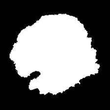</a> |
| `1488` | <a href="resized_images/1488_before_resizing.png">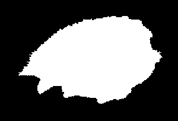</a> | <a href="resized_images/1488_resized.png">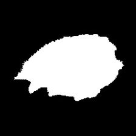</a> |
| `1505` |  | <a href="resized_images/1505_resized.png">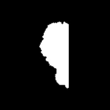</a> |
| `1976` | <a href="resized_images/1976_before_resizing.png">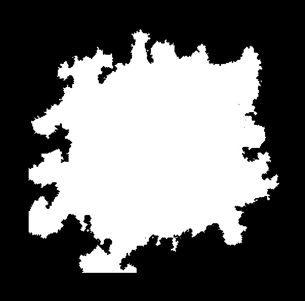</a> | <a href="resized_images/1976_resized.png">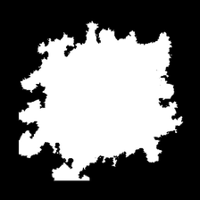</a> |
| `2168` |  | <a href="resized_images/2168_resized.png">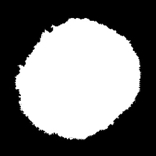</a> |
| `2332` | <a href="resized_images/2332_before_resizing.png">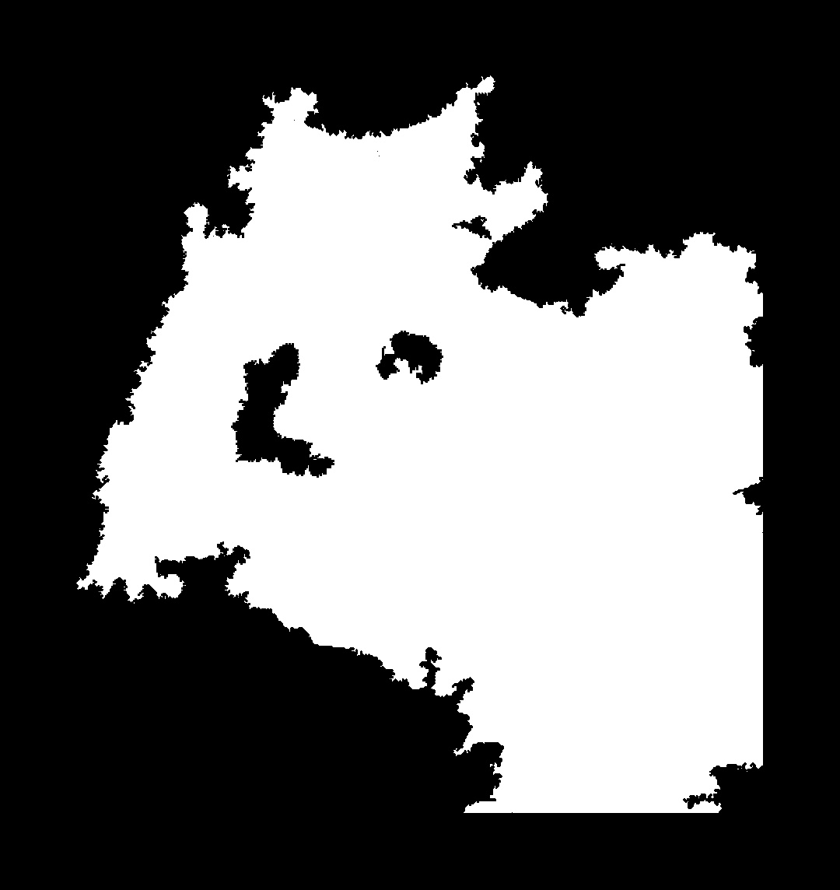</a> | <a href="resized_images/2332_resized.png">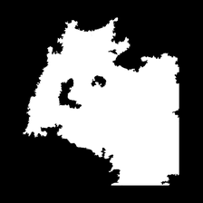</a> |

